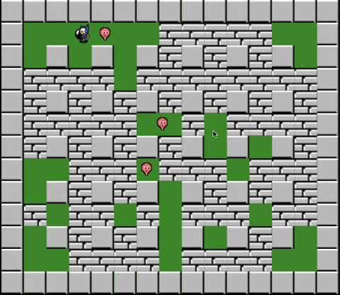

# Nade Raid
A strategic, maze-based game inspired by Bomberman.

### Live
[Live](http://rlee.me/nade_raid)

### Functionality
Users can:
* Start the game
* Place bombs
* Trap monsters
* Move around walls with adjustment



### Implementation
This game was built using Vanilla JavaScript leveraging HTML5 Canvas API. Sprite sheets were used for all animations as showcased above. Movement was adjusted with browser's refresh rate using `requestAnimationFrame` web API to smooth out movement.

To achieve this, time between each frame was kept track of and normalized based on a normal refresh rate of 60 frames per second:
```js
// game_view.js

start() {
  ...
  this.lastTime = 0;
  requestAnimationFrame(this.animate.bind(this));
}

animate(time) {
  const timeChange = time - this.lastTime;
  ...
  requestAnimationFrame(this.animate.bind(this));
}


// player.js

move(timeChange) {
  const normalizedFrame = timeChange / (1000 / 60);
  ...
  this.pos += 2 * normalizedFrame;
}
```
Collision detection posed a great challenge. I wanted improve playability by allowing the player to move around walls without getting stuck. When creating conditional collision detection, there were some collision conditions that matched with others causing undesirable player movement. Ultimately, I had to write out specific collision conditions until my desired outcome was met.
